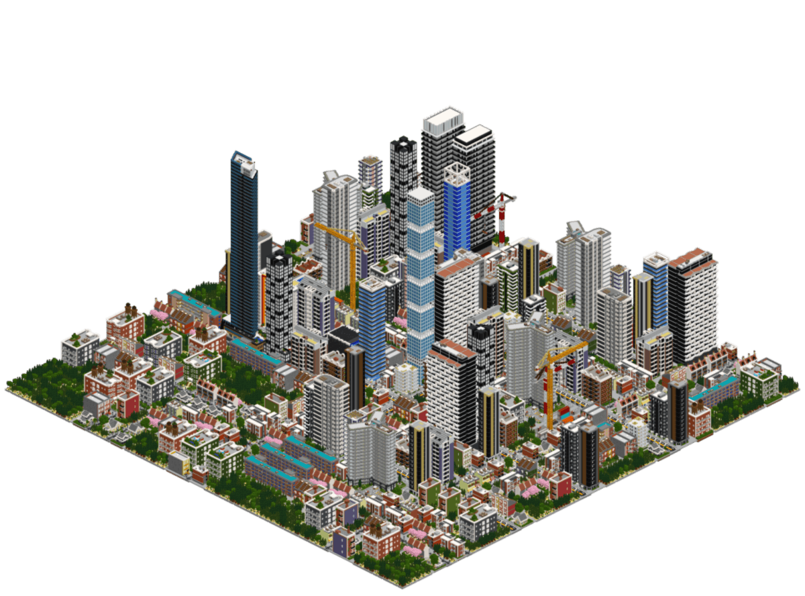
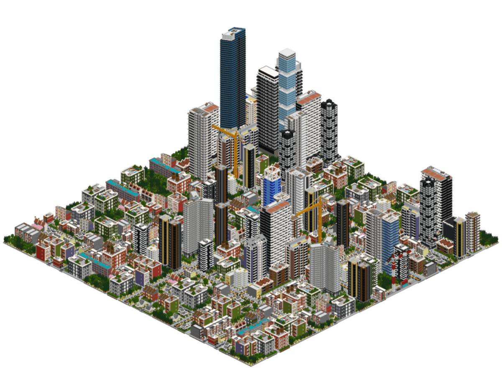
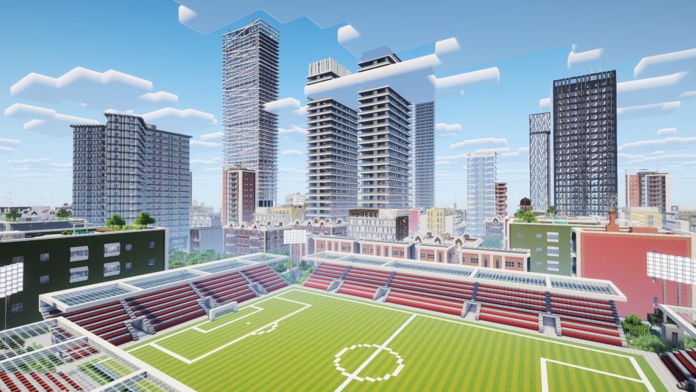
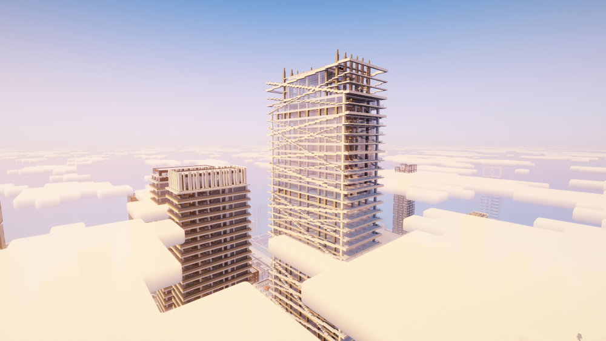
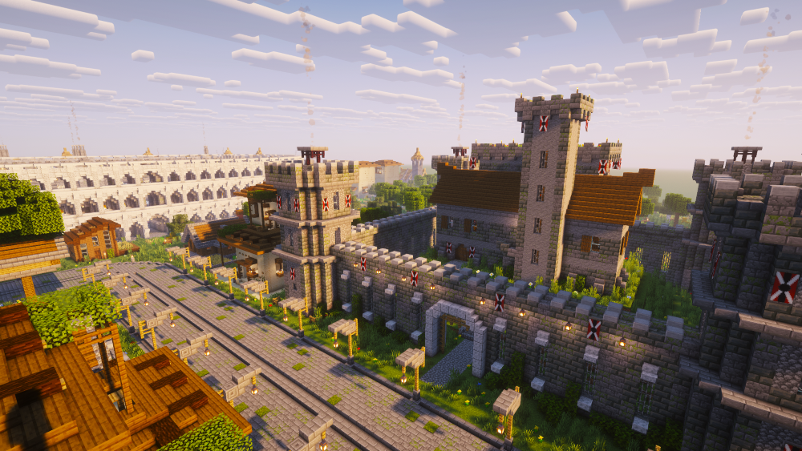
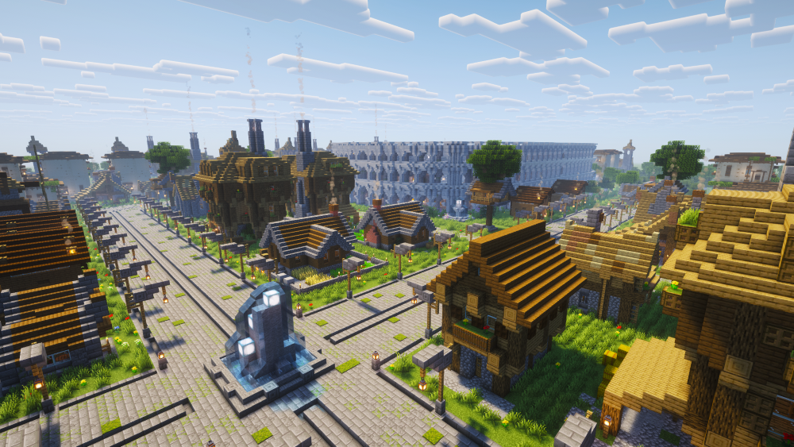
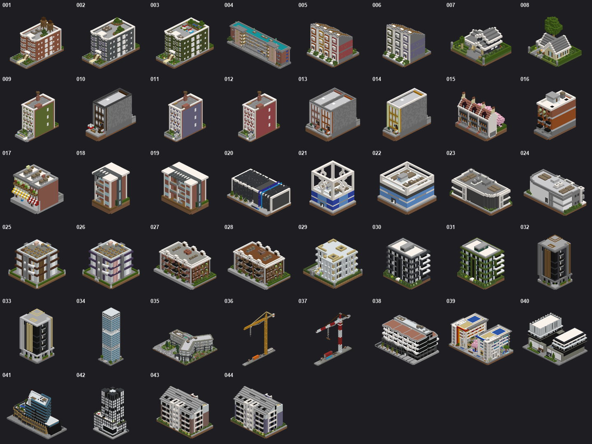
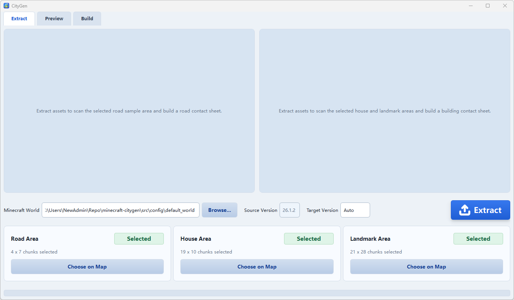
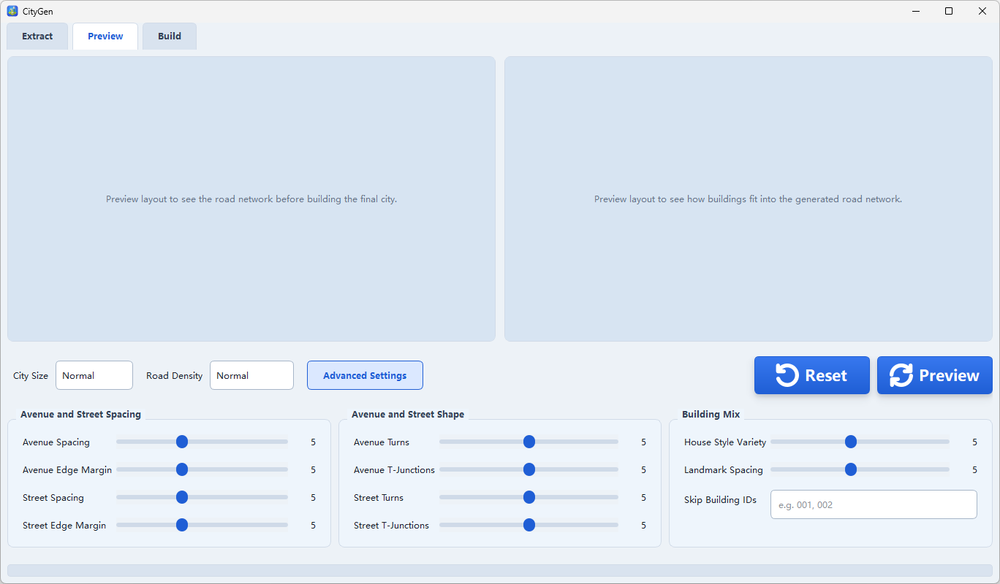
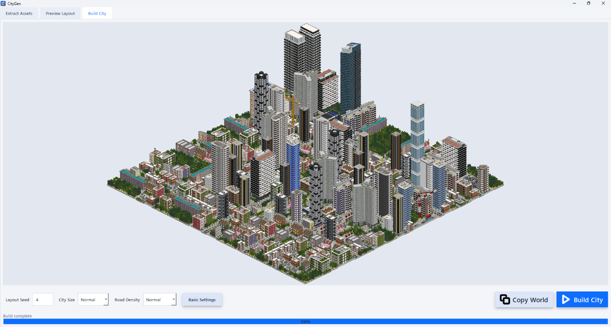

<div align="center">
  <h1>CityGen - Customizable Minecraft City Generator</h1>
  
  <br><br>
  
  <!-- Minecraft badge logo: Pictogrammers Material Design Icons (Apache-2.0), https://github.com/Templarian/MaterialDesign/blob/master/svg/minecraft.svg -->
  = 26.1.2">
  <h3>
    Download <a href="https://github.com/doubletrends/minecraft-citygen/releases/download/v1.0.1/CityGen-setup.exe">Windows Installer (.exe)</a> or
    <a href="https://github.com/doubletrends/minecraft-citygen/releases/download/v1.0.1/CityGen-portable-windows.zip">Compressed Portable (.zip)</a>
  </h3>
  <br>
</div>

**Build a TheoTown style Minecraft city from your own roads and buildings in minutes.**

This project turns a small handcrafted asset set into a complete city layout, preview, and paste-ready in-game result. It is designed for creators who want large-scale city generation without giving up the look and feel of their own Minecraft builds.

## Rendering Result





## In-Game Result

The generated city can be brought back into Minecraft as a real build result:









## Built-in Assets

These buildings come with the app by default:



## Desktop Workflow

The app includes extraction tools, previews, and a generation UI built for iteration:







## Tutorial - Marking Your Own Assets

CityGen builds cities from structures you mark up inside your own Minecraft world,
using a handful of marker blocks.

For buildings, place a *gold block* and a *diamond block* at two opposite corners
of each region you want captured. One gold/diamond pair creates a one-piece
building. Three vertically aligned pairs with the same footprint create a
stackable building with bottom, middle, and top pieces. A sign inside the
building footprint can set stack options.

Roads and fill props use the same marker format. Their sign names the exported
road/fill asset.

Marker blocks are stripped from the exported result automatically. In-cuboid
signs and other block entities are preserved as real content, so put authoring
signs outside the captured cuboid if you do not want them in the finished city.

### Building Types And Layers

**Type 1 — standard frontage buildings.** These fill ordinary street lots. They
can be one-piece buildings or stackable three-piece buildings.


**Type 2 — landmarks.** These are placed first on big-road frontage and appear
once per generated city. Larger landmark footprints are placed first, with a
tunable fine-cell spacing between landmarks. They can also be one-piece or
stackable three-piece buildings.


You can tune any three-piece building with a sign directive inside its footprint:

- `stack: 3-7` — how many middle sections it may grow (min–max)

## For Technical Details

See the [source architecture overview](src/README.md) and its per-package guides
([config](src/config/README.md), [engine](src/engine/README.md),
[gui](src/gui/README.md), [pipeline](src/pipeline/README.md)).

## Developer Quick Start

```bash
python -m pip install -e .
pytest -q
pythonw application.pyw
```

The source tree is organized as four packages under `src/`: `config`, `engine`,
`gui`, and `pipeline`. Generated previews, schematics, renders, exported worlds,
test caches, and packaging outputs live in git-ignored directories such as
`artifacts/`, `build/`, and `dist/`. To clear regenerated local outputs:

```bash
python tools/clear_cache.py
```

Pipeline stages can be run from their script paths in a checkout, for example:

```bash
python src/pipeline/04_city/stage.py --seed 5
```

Use `MC_CITY_*` environment overrides through `pipeline.services` for in-process
runs; the pipeline runtime applies them under a lock and reloads import-time
configuration safely for one run at a time.

### Supported Minecraft Versions


