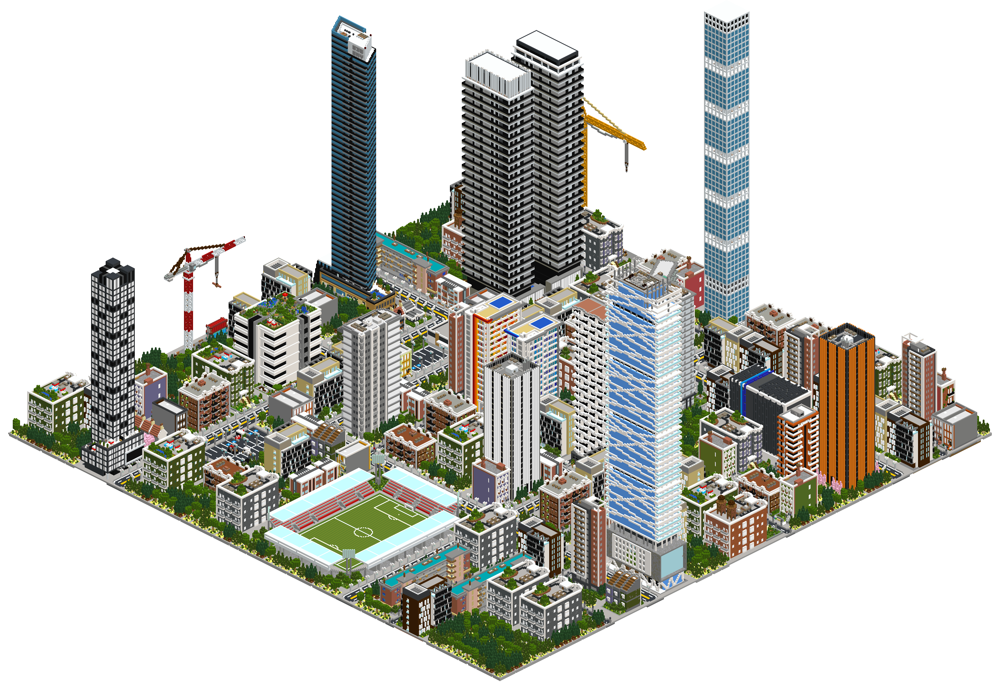
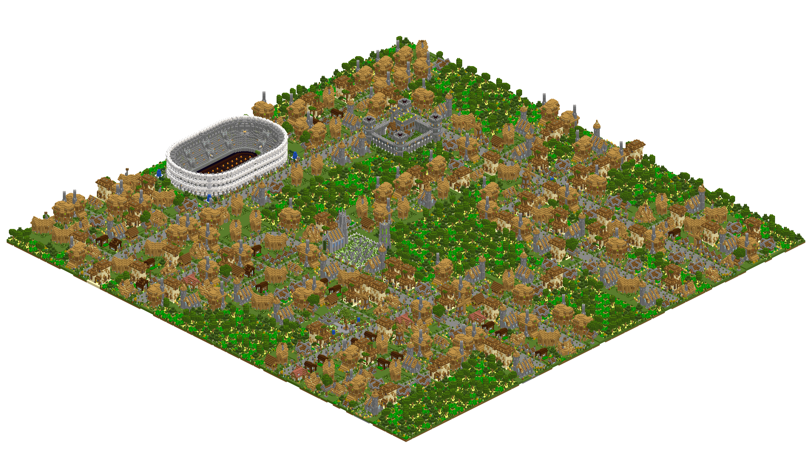
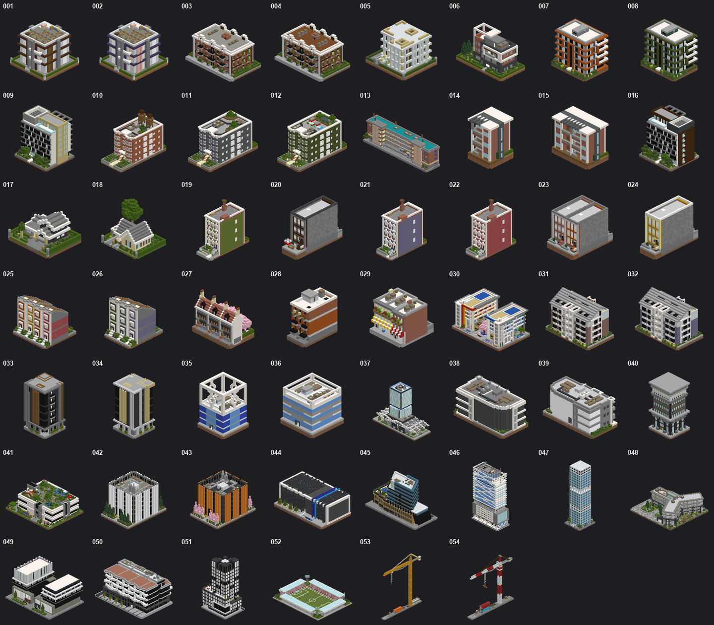
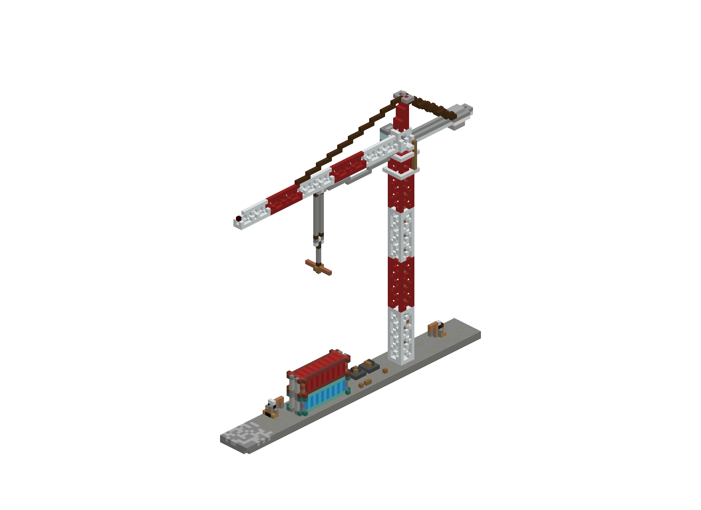
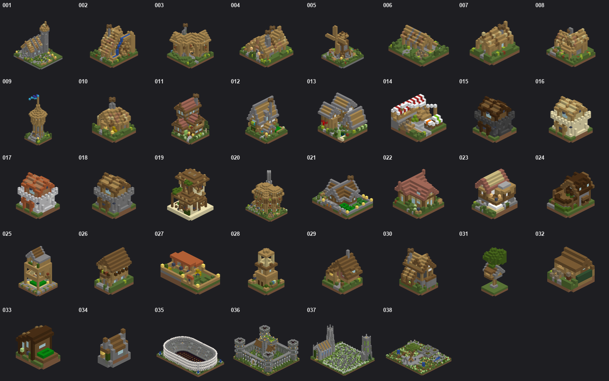
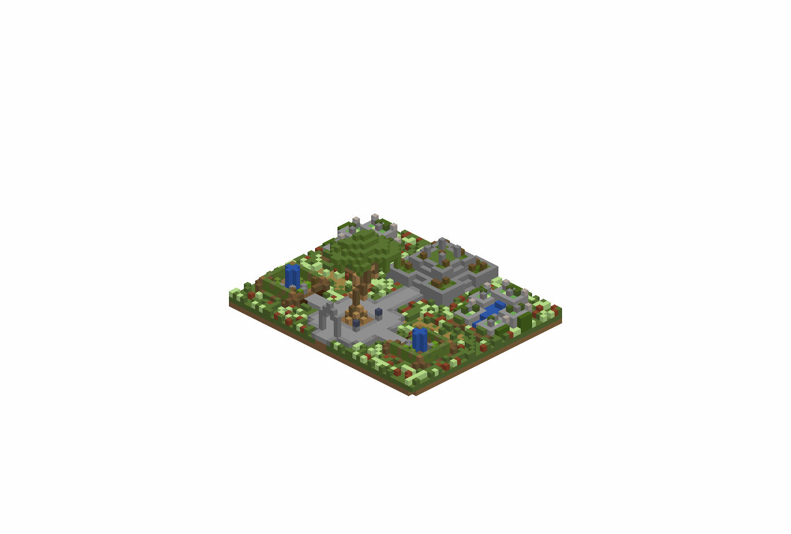

<div align="center">
  <h1>Minecraft CityGen - Customizable AI City Generator</h1>
  
  <br><br>
  
  <!-- Minecraft badge logo: Pictogrammers Material Design Icons (Apache-2.0), https://github.com/Templarian/MaterialDesign/blob/master/svg/minecraft.svg -->
  = 26.1.2">
  <h3>
    Turn your own Minecraft builds into an entire city.
    <br><br>
    Download <a href="https://github.com/doubletrends/minecraft-citygen/releases/download/v1.1.0/Minecraft.CityGen-setup.exe">Windows Installer (.exe)</a> or
    <a href="https://github.com/doubletrends/minecraft-citygen/releases/download/v1.1.0/Minecraft.CityGen-portable-windows.zip">Compressed Portable (.zip)</a>
  </h3>
</div>

# Rendering Result

<table>
  <tr><th>Modern City</th><th>Medieval City</th></tr>
  <tr>
    <td valign="bottom" align="center"></td>
    <td valign="bottom" align="center"></td>
  </tr>
</table>

# In-Game Result

| Modern City| Medieval City |
| --- | --- |
|  |  | 
|  |  | 

# Built-in Assets (Modern + Medieval)

| Assets Overview | Individual Asset |
| --- | --- |
|  |  | 
|  |  | 

# User Interface

| Extraction | Preview & Generation |
| --- | --- |
|  |  |

# Tutorial - Marking Your Own Assets

**Minecraft CityGen** builds cities from structures you mark up inside your own Minecraft world,
using a handful of marker blocks.

For buildings, place: 
- a **Gold block** and a **Diamond block** at two opposite corners of each region you want captured.
- an **Emerald block** horizontally adjacent to the bottom gold block to mark the authored ground level. 

One gold/diamond pair creates a one-piece building. Three vertically aligned pairs
with the same footprint create a stackable building with bottom, middle, and top
pieces. Placement type is independent from layer count: type-1 controls
repeatable city buildings, type-2 controls unique landmarks, and either type can
be authored as a one-piece or three-piece asset. A sign above the emerald can set
stack options.

You can tune any three-piece building with a sign directive above its emerald: `stack: 3-7` — how many middle sections it may grow (min–max)


The exact rules for roads and buildings are in the
[in-world asset conventions](src/pipeline/README.md#in-world-asset-conventions).

# Technical Details

```bash
python -m pip install -e .
python -m pytest -q
pythonw application.pyw
```

Start at the [source architecture overview](src/README.md), then follow the
package guides: [config](src/config/README.md), [engine](src/engine/README.md),
[pipeline](src/pipeline/README.md), [gui](src/gui/README.md), and
[packaging](packaging/README.md) for releases.

## AI Disclaimer

> Every asset in this app was hand-built by the author, placed block by block, over a development period spanning 2017 to 2026. Code and implementation were developed with AI assistance from **Claude Fable** and **GPT Astra**.
