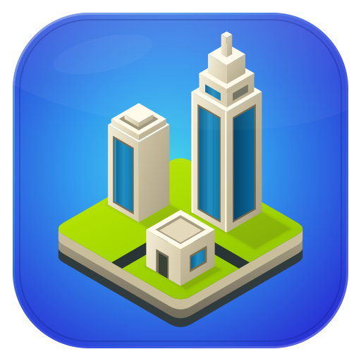

<div align="center">
  <h1>CityGen - Minecraft City Generator</h1>
  
  <br><br>
  
  = 1.20">
  <h3>
    Download <a href="https://github.com/doubletrends/minecraft-citygen/releases/download/v1.0.1/CityGen-setup.exe">Windows Installer (.exe)</a> or
    <a href="https://github.com/doubletrends/minecraft-citygen/releases/download/v1.0.1/CityGen-portable-windows.zip">Compressed Portable (.zip)</a>
  </h3>
  <br>
</div>

**Build a TheoTown style Minecraft city from your own roads and buildings in minutes.**

This project turns a small handcrafted asset set into a complete city layout, preview, and paste-ready in-game result. It is designed for creators who want large-scale city generation without giving up the look and feel of their own Minecraft builds.

## Rendering Result


## In-Game Result

The generated city can be brought back into Minecraft as a real build result:


## Built-in Assets

These buildings come with the app by default:


## Desktop Workflow

The app includes extraction tools, previews, and a generation UI built for iteration:


## Tutorial - Marking Your Own Assets

CityGen builds cities from structures you mark up inside your own Minecraft world,
using a handful of marker blocks. Roads, buildings, and fillers all follow the
**same** convention:

- **Wool** — outline each asset with a wool rectangle. One connected wool shape is one asset.
- **Gold + Diamond** — place a *gold block* and a *diamond block* at two opposite corners of the region you want captured.
- **Emerald** — place exactly one *emerald block* at ground level so the tool knows where the ground is.
- **Sign** — put a sign inside the asset to name it (and, for buildings, to set options).

Marker blocks and signs are stripped from the exported result automatically — they
never show up in your finished city.

### Two Building Types

**Type 1 — a single building.** One gold/diamond pair marks the whole build.
Best for smaller, street-front buildings.


**Type 2 — a stackable building.** Three gold/diamond pairs mark a **bottom**, a
**middle**, and a **top**. CityGen stacks copies of the middle to vary the height,
so one build becomes many. Best for towers and landmarks.


You can tune a type-2 building with sign directives placed inside its boundary:

- `stack: 3-7` — how many middle sections it may grow (min–max)
- `appearance: 2-4` — how many times it should appear across a city (min–max)

## For Technical Details

See the [source architecture overview](src/README.md) and its per-package guides
([config](src/config/README.md), [engine](src/engine/README.md),
[gui](src/gui/README.md), [pipeline](src/pipeline/README.md)).

## Developer Quick Start

```bash
python -m pip install -e .
pytest -q
pythonw application.pyw
```

The source tree is organized as four packages under `src/`: `config`, `engine`,
`gui`, and `pipeline`. Generated previews, schematics, renders, exported worlds,
test caches, and packaging outputs live in git-ignored directories such as
`artifacts/`, `build/`, and `dist/`. To clear regenerated local outputs:

```bash
python tools/clear_cache.py
```

Pipeline stages can be run from their script paths in a checkout, for example:

```bash
python src/pipeline/04_city/construct.py --seed 5
```

Use `MC_CITY_*` environment overrides through `pipeline.services` for in-process
runs; the pipeline runtime applies them under a lock and reloads import-time
configuration safely for one run at a time.

### Supported Minecraft Versions


