<div align="center">

  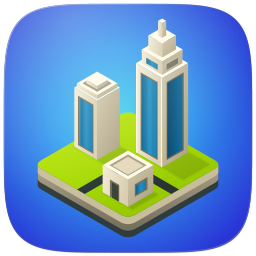<br>

  
  <a href="https://github.com/chengmarc/minecraft-citygen/releases/latest/download/Minecraft.CityGen-setup.exe"></a>

  <h1>Minecraft CityGen - Procedural City Generator</h1>
</div>

<table>
  <tr><th>Modern City</th><th>Medieval City</th></tr>
  <tr>
    <td valign="bottom" align="center">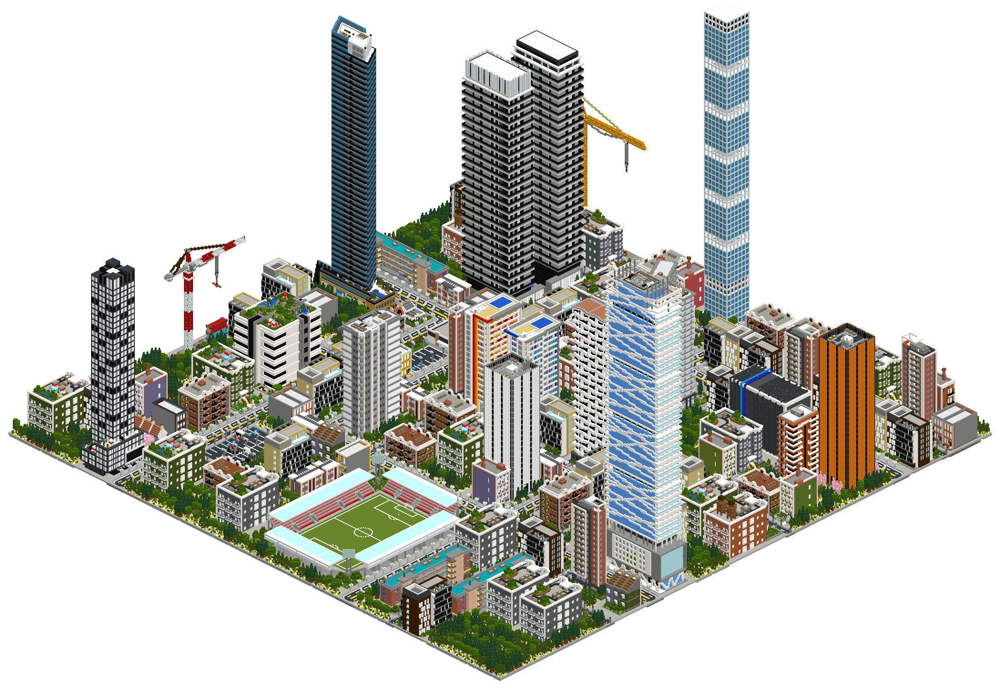</td>
    <td valign="bottom" align="center">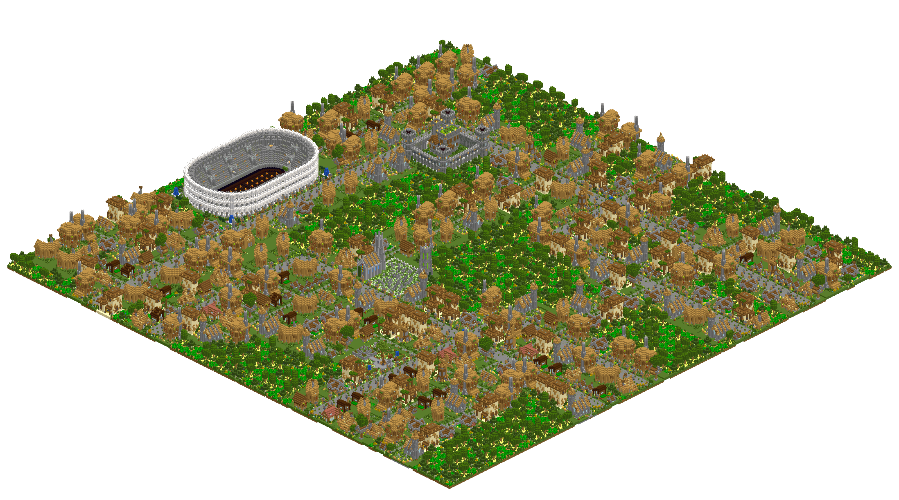</td>
  </tr>
  <tr>
    <td>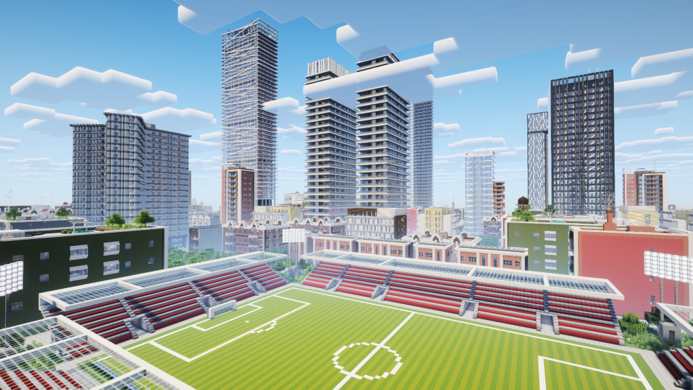</td>
    <td>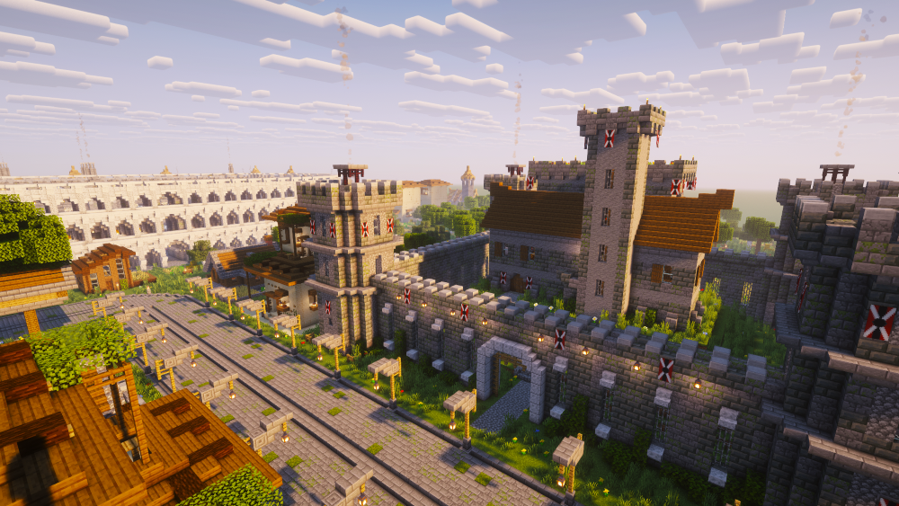</td>
  </tr>
  <tr>
    <td>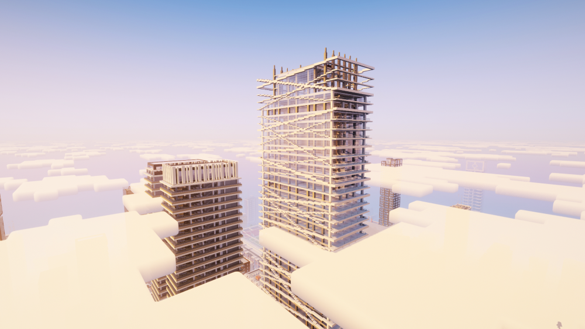</td>
    <td>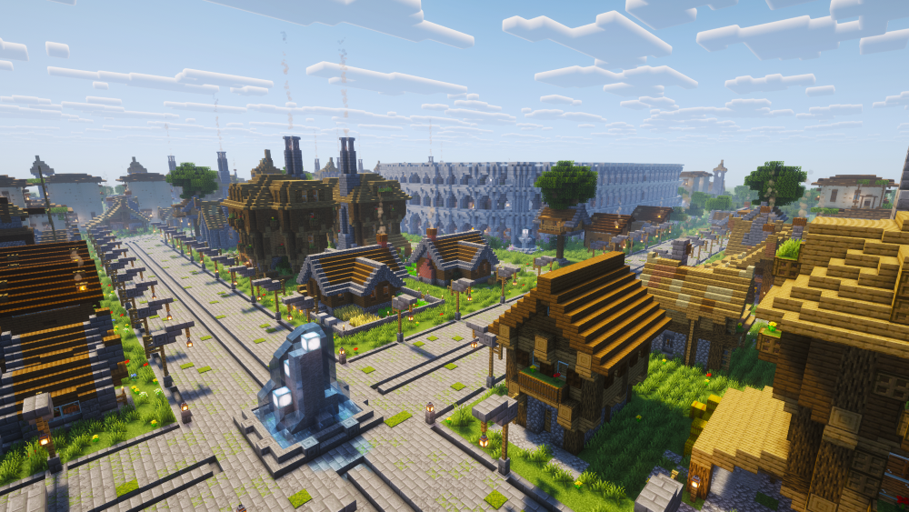</td>
  </tr>
</table>

# Built-in Assets

| Assets Overview | Individual Asset |
| --- | --- |
| 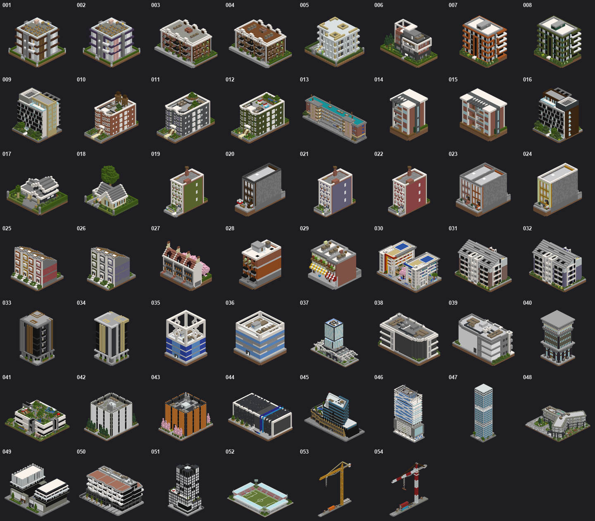 | 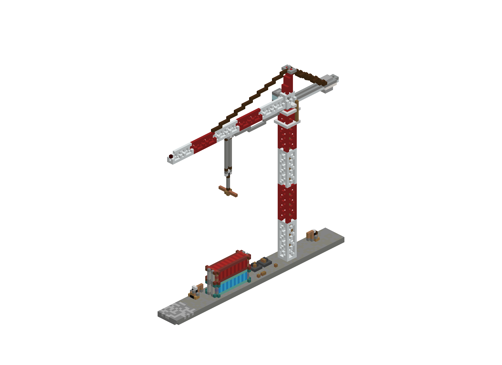 | 
| 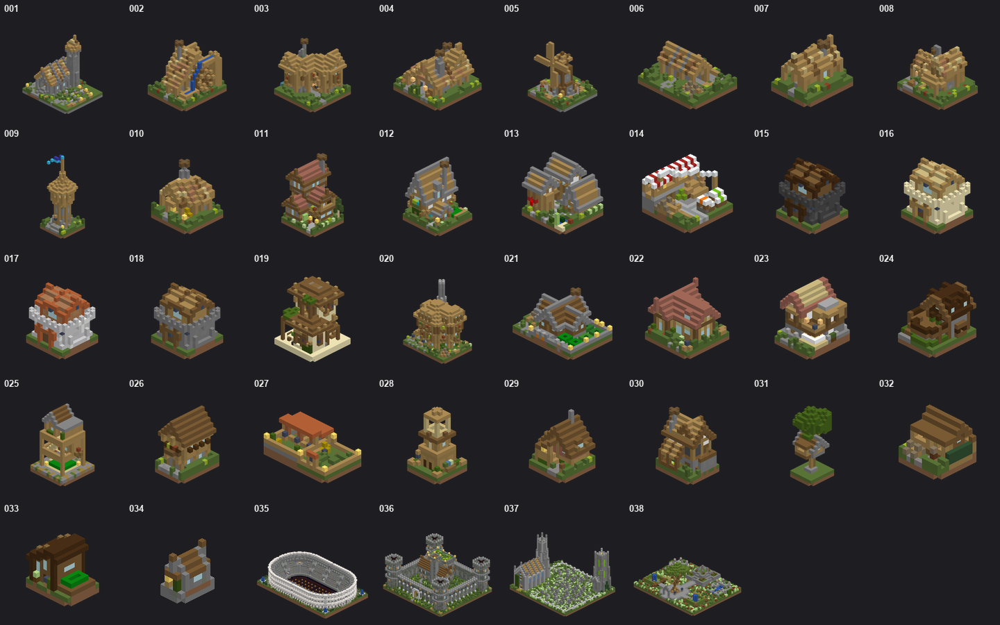 | 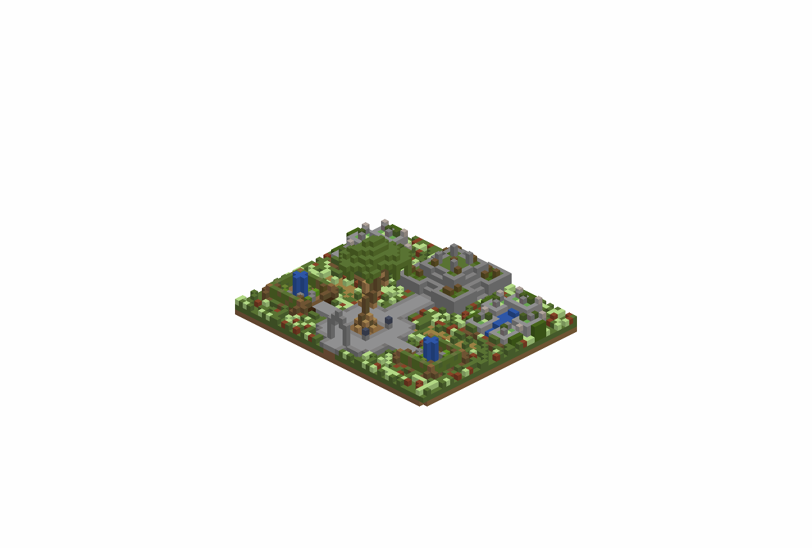 | 

# User Interface

| Extraction | Preview & Generation |
| --- | --- |
| 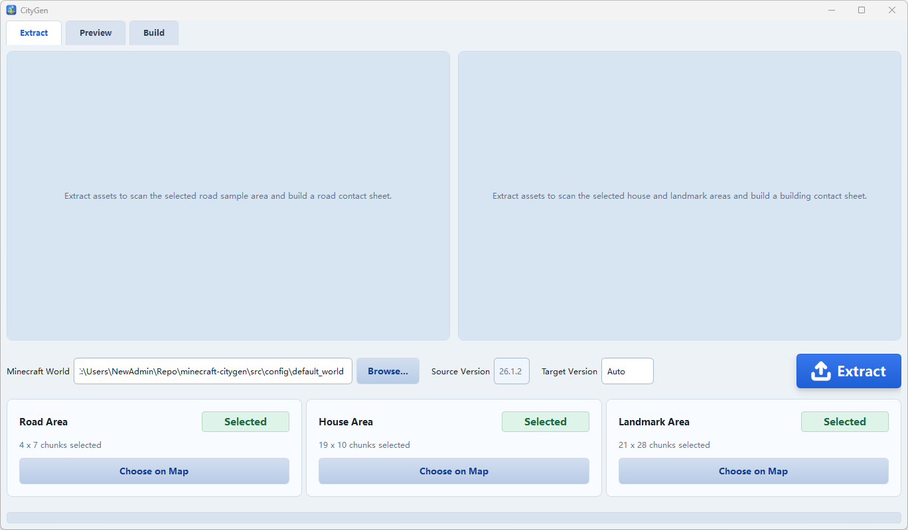 | 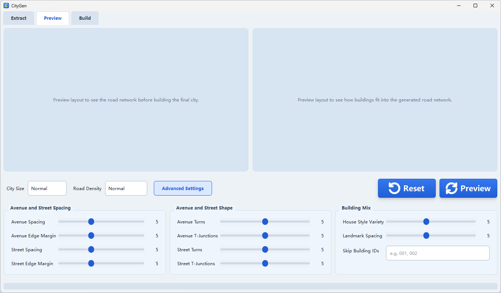 |

# Tutorial - Marking Your Own Assets

**Minecraft CityGen** builds cities from structures you mark up inside your own Minecraft world,
using a handful of marker blocks.

For buildings, place: 
- a **Gold block** and a **Diamond block** at two opposite corners of each region you want captured.
- an **Emerald block** horizontally adjacent to the bottom gold block to mark the authored ground level. 

One gold/diamond pair creates a one-piece building. Three vertically aligned pairs
with the same footprint create a stackable building with bottom, middle, and top
pieces. Placement type is independent from layer count: type-1 controls
repeatable city buildings, type-2 controls unique landmarks, and either type can
be authored as a one-piece or three-piece asset. A sign above the emerald can set
stack options.

You can tune any three-piece building with a sign directive above its emerald: `stack: 3-7` — how many middle sections it may grow (min–max)

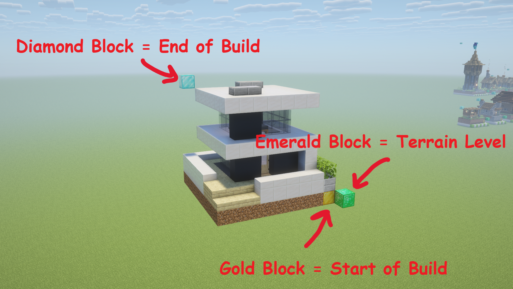

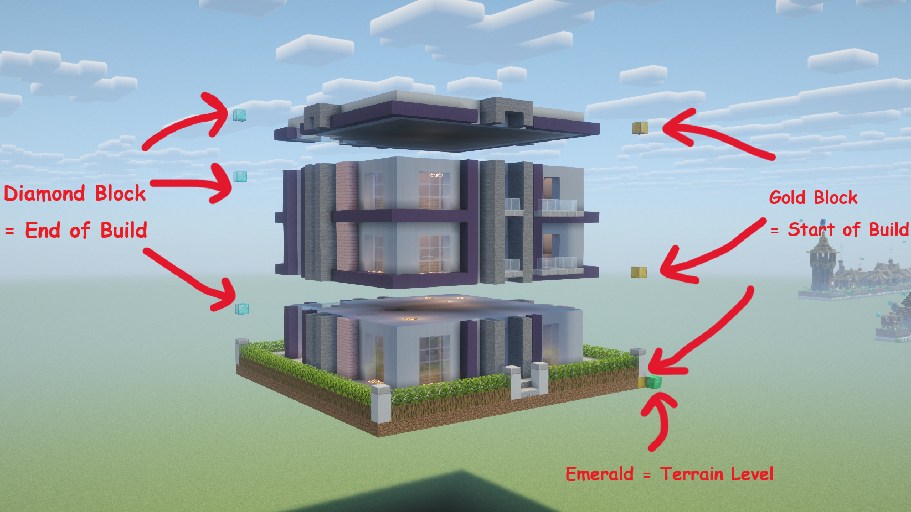

The exact rules for roads and buildings are in the
[in-world asset conventions](src/pipeline/README.md#in-world-asset-conventions).

# Technical Details

```bash
python -m pip install -e .
python -m pytest -q
pythonw application.pyw
```

Start at the [source architecture overview](src/README.md), then follow the
package guides: [config](src/config/README.md), [engine](src/engine/README.md),
[pipeline](src/pipeline/README.md), and [gui](src/gui/README.md). Releases
follow the [release guide](docs/RELEASING.md).

## AI Disclaimer

> Every asset in this app was hand-built by the author, placed block by block, over a development period spanning 2017 to 2026. Code and implementation were developed with AI assistance from **Claude Fable** and **GPT Astra**.
