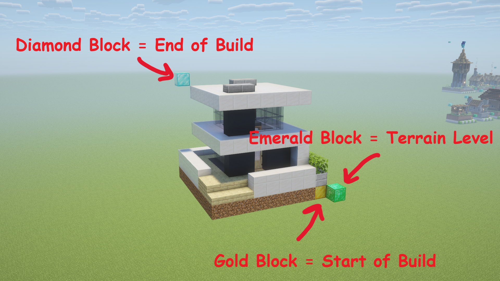
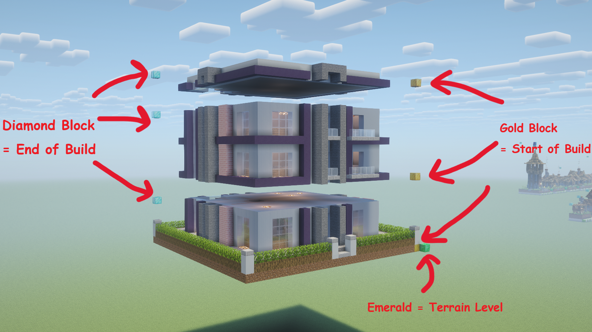

# pipeline — stage orchestration

Runs [engine](../engine/README.md) work in five numbered stages, from a marked-up
Minecraft world to a city schematic and a ready-to-play world. The pipeline
decides which artifact paths and settings each engine call gets; the engine
does the work.

← Back to the [source architecture overview](../README.md).

## How-to guides

### Run the pipeline from a checkout

```bash
python src/pipeline/stages.py roads
python src/pipeline/stages.py builds
python src/pipeline/stages.py preview --seed 5
python src/pipeline/stages.py city --seed 5
python src/pipeline/stages.py world --seed 5
```

Each stage reads the previous stages' artifacts, so run them in order. With
`src/` on `PYTHONPATH` or the project installed, `python -m pipeline.stages
<stage>` works the same. Settings not exposed as flags come from `MC_CITY_*`
([config guide](../config/README.md#overrides)).

### Run one step while debugging

Every step module is also a script, with a few extra flags the stage CLI
doesn't expose:

```bash
python src/pipeline/04_city/construct.py --seed 5 --no-ground-fill
python src/pipeline/03_preview/builds.py --key 001
python src/pipeline/03_preview/city.py --seed 5 --out /tmp/city.png
```

### Add a step to a stage

1. Write the module inside the stage's numbered package. Expose
   `run(*, <params>, logger=None, progress=None)` that returns a dict. Import
   helpers from [step.py](step.py), never from `stages.py` — the registry
   imports the step modules, so the reverse import would be a cycle.
2. Register it as a `Step(key, label, module, params)` in `STAGES` in
   [stages.py](stages.py). `params` names the stage parameters forwarded to
   `run`; a parameter the CLI should accept also needs an entry in
   `CLI_OPTIONS` ([step.py](step.py)), and an integer the GUI sends as text
   needs one in `_INTEGER_PARAMS` ([services.py](services.py)).
3. Mirror the module in the packaging hidden imports
   ([release guide](../../docs/RELEASING.md#keep-the-build-in-step-with-a-new-pipeline-step)).
4. Give the step a progress weight in the GUI
   ([gui guide](../gui/README.md#re-tune-a-progress-bar)).
5. A new numbered package (`06_…`) also needs a layer in `PART_LAYERS` in
   `tests/test_dependencies.py`.

`python -m pytest -q` catches a missing hidden import (step 3), a missing
Preview or construct progress weight (step 4), and a missing layer (step 5).

### Author assets in the world

Follow the marker conventions in [In-world asset conventions](#in-world-asset-conventions),
then run `roads` and `builds` and check the contact sheets in
`artifacts/01_roads/renders/` and `artifacts/02_builds/renders/`. An asset
missing from a sheet had malformed markers and was skipped.

## Explanation

### One registry, one runner

`STAGES` in [stages.py](stages.py) lists each stage's steps in order, and
`run_stage` is the only code that walks them. The CLI and the GUI both call it,
so a step behaves the same however it's launched. `run_stage` rejects
parameters no step of that stage accepts, so a typo fails immediately instead of
being ignored.

### Per-run settings are parameters

`algo`, `save`, `road_box`, `build_types`, and `data_version` are ordinary
stage parameters. When one is omitted, the step falls back to the process
default in `config` (read once from `MC_CITY_*` at startup). Nothing reads
`os.environ` between runs and nothing is reloaded.
[services.py](services.py) adds two things for the GUI: text-to-int coercion,
and `PIPELINE_LOCK`, which runs stages one at a time because every stage reads
and writes the same `artifacts/` directories.

### The stages

1. **Roads.** Extracts the named road pieces and fill props from `ROAD_BOX`,
   then renders a road contact sheet.
2. **Builds.** Scans the `BUILD_TYPES` regions, exports each building's pieces,
   and writes `buildings.json` — the catalog every later stage places from.
   Then renders a building contact sheet.
3. **Preview.** Makes flat stand-in images for roads and buildings, then renders
   the seed's road layout and city layout. It is fast because nothing is
   built in blocks, but it uses the same `plan_city` as Stage 4, so the layout
   matches the final city exactly.
4. **City.** Generates the road grid, plans placements from the seed, seats
   buildings (sampling stack heights for three-piece ones), composes one voxel
   grid, fills empty lots, and writes the city `.schem`. Then renders it
   isometrically.
5. **World.** Copies the selected source save, deletes only its overworld region
   files, and writes the city chunks in their place. The city is centred on the
   world origin with its ground near y=64, and the spawn and player are placed on
   solid ground, so the world opens standing on the city.

### Why markers, not inference

Extraction reads explicit marker blocks rather than guessing where an asset
starts and ends. Markers make every cuboid exact, let one region hold many
assets side by side, and carry the ground level and metadata (the emerald and
its sign). The cost is strictness: an asset with malformed markers is skipped,
not repaired.

## Reference

### Layout

| Module / package | Responsibility |
|---|---|
| [stages.py](stages.py) | `STAGES` registry, `run_stage`, the stage CLI |
| [step.py](step.py) | What step modules import: `noop`, `CLI_OPTIONS`, `run_stage_cli` |
| [services.py](services.py) | `run_stage` for the GUI: int coercion, `PIPELINE_LOCK` |
| [extraction.py](extraction.py), [rendering.py](rendering.py) | Helpers shared by extract and render steps |
| `01_roads/` | [extract.py](01_roads/extract.py), [render.py](01_roads/render.py) |
| `02_builds/` | [extract.py](02_builds/extract.py), [render.py](02_builds/render.py) |
| `03_preview/` | [roads.py](03_preview/roads.py), [builds.py](03_preview/builds.py), [grid.py](03_preview/grid.py), [city.py](03_preview/city.py) |
| `04_city/` | [construct.py](04_city/construct.py), [render.py](04_city/render.py) |
| `05_world/` | [export.py](05_world/export.py) |

Which parameters each step takes is in `STAGES` ([stages.py](stages.py)).

### In-world asset conventions

The root README has an illustrated walkthrough; this is the exact contract.

#### Roads & fill props

- Scanned inside `ROAD_BOX`. Markers are searched over `BUILD_MARKER_Y_RANGE`,
  so a tile taller than `ROAD_BOX` is still captured in full.
- Each asset: one gold/diamond pair at opposite corners, and an emerald
  horizontally adjacent to the gold marking ground level.
- The sign one block above the emerald gives the exported name, e.g.
  `02_big_2x2_I`. The two-digit prefix decides what the asset is — see the
  [road asset prefixes](../engine/README.md#reference).
- Fill props: a name containing `fill` (e.g. `15_fill_1x1_A`); each is a
  self-contained 9x9 (one fine cell) asset with its own ground. A random,
  randomly-rotated fill prop goes in every fully empty lot cell.
- Asset `18` is the required ground fill, repeated across empty lot ground that
  has no building or fill prop.

#### Builds

- Scanned inside each `BUILD_TYPES` region; the region's `type` is the
  placement type of every asset in it (1 = repeatable building, 2 = landmark,
  placed at most once per city).
- Each gold pairs with the closest unused diamond; each pair is one cuboid's
  opposite corners. Cuboids with the same X/Z footprint stack into one asset.
- **One pair** → one `whole` piece. **Three vertically aligned pairs** →
  `bottom`/`middle`/`top` pieces; the middle can repeat to vary height. Any
  other count is skipped.

  
  

- An emerald horizontally adjacent to the bottom gold marks the asset's ground
  level. Assets without one are skipped.
- Optional sign directive above the emerald: `stack: n` or `stack: min-max`,
  the number of middle sections a three-layer building may get (default `1`).
- Placement type and layer count are independent.

### `buildings.json`

Written by Stage 2 to `artifacts/02_builds/buildings.json`, read through
[`engine.schematic.building`](../engine/schematic/building.py). Keys are
sequential IDs (`"001"`, `"002"`, …). Each entry:

| Field | Meaning |
|---|---|
| `type` | Placement type, 1 or 2 |
| `size` | `[width, depth]` in blocks |
| `origin` | World position the asset was extracted from |
| `ground_offset` | Height of the emerald within the asset |
| `pieces` | Height per piece: `whole`, or `bottom`/`middle`/`top` |
| `stack` | `[min, max]` middle repeats; three-layer entries only |

### Outputs

```text
artifacts/01_roads/schem/*.schem              road pieces and fill props
artifacts/01_roads/renders/*.png              + _contact_sheet.png
artifacts/02_builds/schem/*.schem             <id>.schem or <id>_<part>.schem
artifacts/02_builds/renders/*.png             + _contact_sheet.png
artifacts/02_builds/buildings.json
artifacts/03_preview/{roads,builds}/*.png     preview stand-ins
artifacts/03_preview/grid/seed_<n>.png        road layout
artifacts/03_preview/city/seed_<n>.png        city layout
artifacts/04_city/schem/seed_<n>.schem        final city (Sponge v3)
artifacts/04_city/renders/seed_<n>.png
artifacts/05_world/saves/Minecraft CityGen World <n>/   playable world; copy into .minecraft/saves/
```

`<n>` is the seed. Every path is defined in [config/path.py](../config/path.py).
